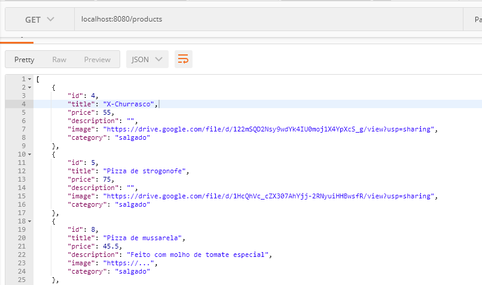

# PROJETO SIMULADO Back-End

### Projeto Simulado do Programa Jovens Tegranos - Back-End

## 🏁 Tópicos
 
  * 👉 [Banner](#📷-banner)
  * 👉 [Título](#📌-título)
  * 👉 [Descrição](#✒️-descrição)
  * 👉 [Status](#⏱️-status)
  * 👉 [Funcionalidades](#🔨-funcionalidades-🛠️)
  * 👉 [Pré-requisitos](#📋-pré-requisitos)
  * 👉 [Tecnologias utilizadas](#⚙️-tecnologias-utilizadas)
  * 👉 [Acesso ao Projeto](#📁-acesso-ao-projeto)
  * 👉 [Autor](#🏆-autor)
  * 👉 [Licença](#🙏-licença-🔖)
 
 
___

## 📷 Banner
  <p align="center">
    
  </p>


___
## 📌 Título

#### Projeto Simulado do Programa Jovens Tegranos - Back-End

___
## ✒️ Descrição

#### Com base na descrição da API, você deve codificar a listagem de produtos (todos) e a listagem com filtro por produto. 
[Documentação](https://tegra-food-skyot.herokuapp.com/api/#/)

___
## ⏱️ Status

>  🚀 Projeto Concluído com Sucesso!!! 👌 🚧

___
## 🔨 Funcionalidades 🛠️

#### utilizar os métodos do `CRUD`:
- `1 `  ✔️ `POST /products` - Save Products
- `2 `  ✔️ `GET /products` - Find Products
- `3 `  ✔️ `GET /products/{id}` - Find Products by id
- `4 `  ✔️ `PUT /products/{id}` - Update Products
- `5 `  ✔️ `DELETE /products/{id}` - Delete Products by id


___
## 📋 Pré-requisitos 

#### Antes de começar, você vai precisar ter instalado em sua máquina as seguintes ferramentas:
- [Git](https://git-scm.com)
- [Node.js](https://nodejs.org/en/). 
#### Além disto é bom ter um editor para trabalhar com o código como [VSCode](https://code.visualstudio.com/)


___
## ⚙️ Tecnologias utilizadas

- [x] Node.js
- [x] Gerenciador de Pacotes - npm
- [x] Express
- [x] Nodemon
- [x] Cors
- [x] Postman
- [x] Git

___
## 📁 Acesso ao Projeto 

### 🎲 Rodando o Back End (servidor)

```bash
# Clone este repositório
$ git clone https://github.com/AlineAlmeida85/PROJETO-SIMULADO-Back-End

# Acesse a pasta do projeto no terminal/cmd
$ cd nome da pasta

# Vá para a pasta server
$ cd server

# Instale as dependências
$ npm install

# Execute a aplicação em modo de desenvolvimento
$ npm run dev:server
# ou
$ npm start

# O servidor inciará na porta:8080 - acesse <http://localhost:8080>
```

___
## 🏆 Autor 
<div align="center">
  <a href="https://github.com/AlineAlmeida85">
    <br/>
    <sub>
      <b>Aline Almeida</b>
    </sub>
  </a> 
  <a href="https://github.com/AlineAlmeida85" title="Aline Almeida"></a>
</div>

___
## Licença 🔖

#### Não Possui

____
Feito com ❤️ por [Aline Almeida](https://github.com/AlineAlmeida85) 👋🏽 Entre em contato! 😊

[](https://www.linkedin.com/in/aline-melissa-andrade-de-almeida-25a78224/) 
[](mailto:aasouza20@gmail.com)

##### Espero que te agrade! 🙏


